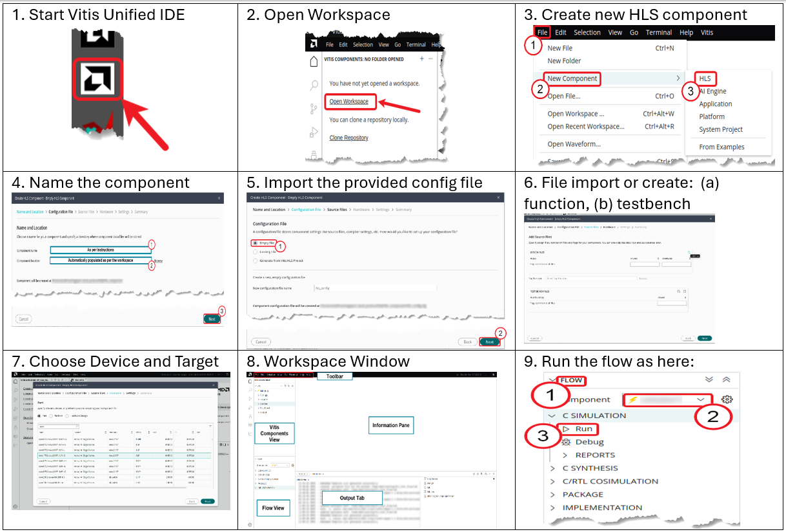

# 01_basic_intro

In this very much a trivial entry level example, we simply show how to create a HLS project from scratch. Currently this would run in Vitis Unified IDE 2025.2. For now disregard the funcitonal content, we will elaborate on subsequent articles. There are multiple ways to accomplish the project creation along AMD Vitis Unified IDE:

## Common source files
- ./src/fir_fixed_taps.h
- ./src/fir_fixed_taps.c
- ./src/fir_fixed_taps_tb.c

<br>

## Scripted Flow
1. Enter the repository directory <br>
   ```$> cd 'RepoPath'/01_basic_intro```  <br>

2. call Vitis Unified Python script <br>
   ```vitis -s <python_script>```   <br>
   where python_script is run.py <br> 

3. From there can open the workspace 'RepoPath'/01_basic_intro/wspc in Vitis 2025.2 and go for CSYNTH, CoSim and packaging, which will be highlighted in next steps.
<br>

## GUI Flow

Steps are shown here:



1. Start AMD Vitis Unified IDE, here 2025.2
2. Open workspace in 'RepoPath'/01_basic_intro/wspc
3. Create a new HLS component named simple_fir
4. through 8. : 
    - Create a new cfg file, 
    - choose technology and base rate
    - import sources <br>
- [9] Run the flow for CSIM, CSYNTH, COSIM and package.

From step 4 can also refer to the 'RepoPath'/hls_config.cfg file to
pick up all settings.

<br>
<br>


## Online Documentation
[Link to BLOG]